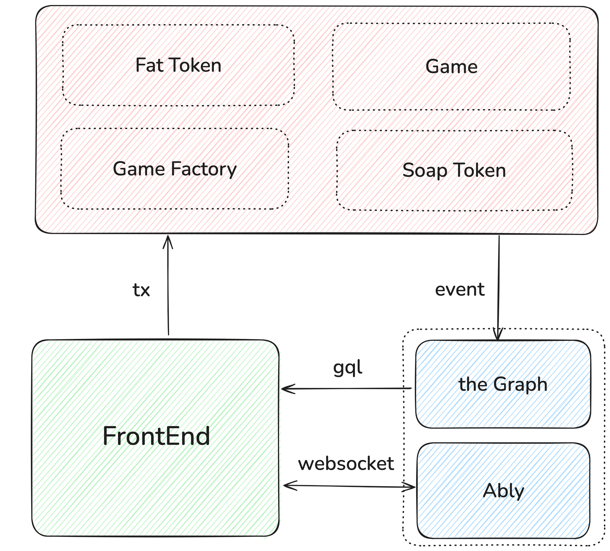
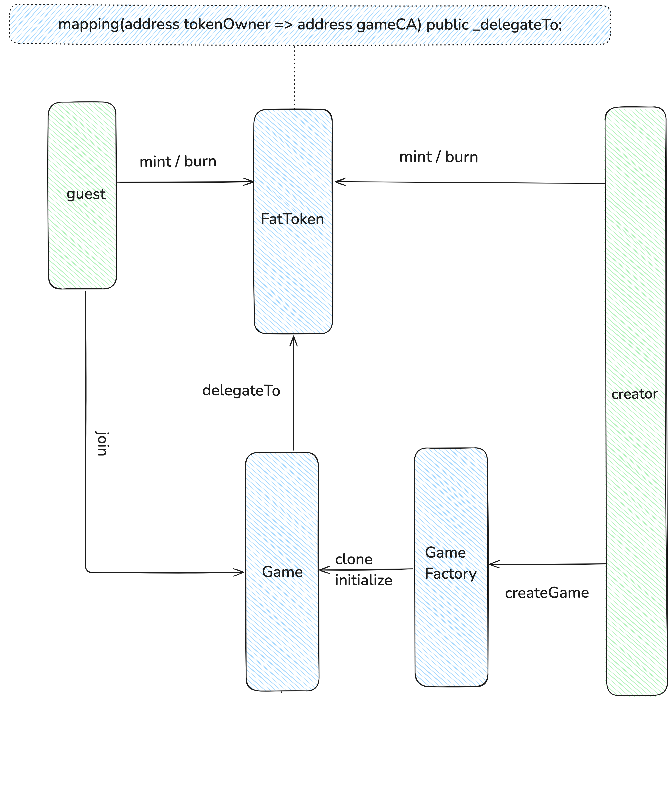
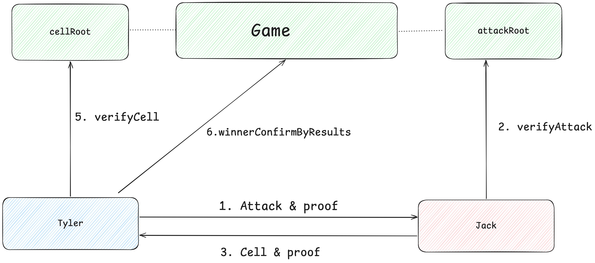
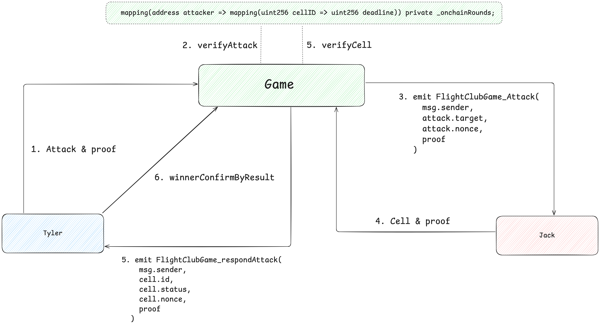
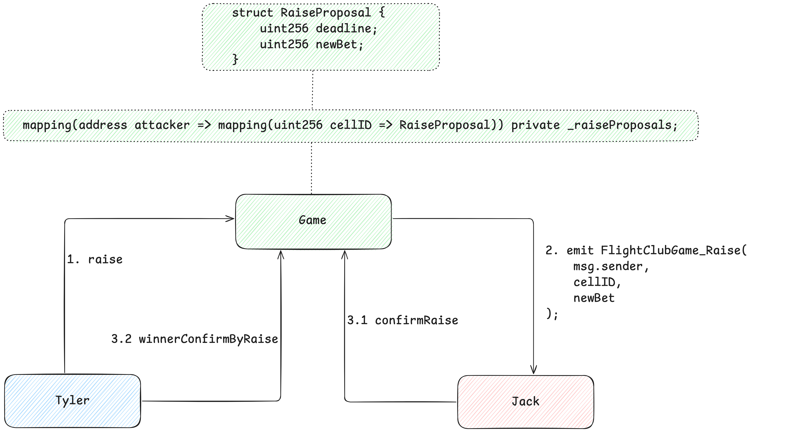
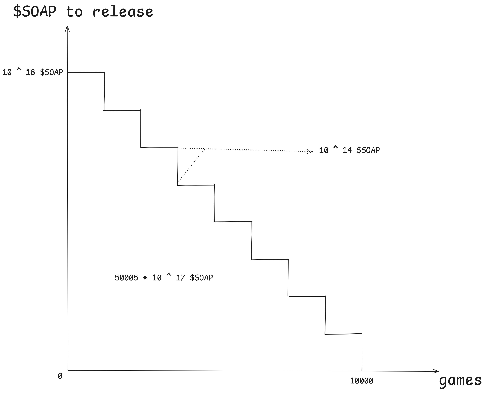

# Flight Club

## Rule

Welcome to Flight Club.

The 1st rule of Flight Club is you do not talk about Flight Club.

The 2nd rule of Flight Club is you DO NOT talk about Flight Club.

The 3rd rule:
Two players form a game, and before the game starts, both parties agree on the stakes. The winner can take away the loser's bet.

The 4th rule:
Each player places three airplanes in any position within a 16 * 16 area. Each turn, both players attack each other once. Hitting the opponent's aircraft head is considered as destroying one of their airplanes. The player who destroys all three of the opponent's airplanes first wins.

The 5th rule:
Whenever one of your airplanes is destroyed, you have the right to increase the stakes; when the opponent increases the stakes, you either match the bet or concede defeat.

## Architecture

## Contracts

### Create&Join Game

### Offchain Rounds

### Onchain Rounds

### Raise

## Tokenomics

